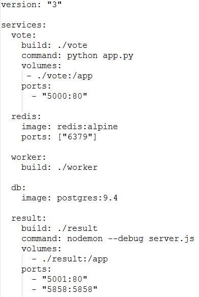

Docker Compose
===============

**Docker compoose info**

* [https://docs.docker.com/compose](https://docs.docker.com/compose)

* Compose is a tool for defining and running multi-container Docker applications. 

* With Compose, you use a Compose file to configure your application’s services. Then, using a single command, you create and start all the services from your configuration. 

* Using Compose is basically a three-step process.

1. Define your app's environment with a Dockerfile so it can be reproduced anywhere.
1. Define the services that make up your app in docker-compose.yml so they can be run together in an isolated environment.
1. Lastly, run docker-compose up and Compose will start and run your entire app.

* The compose file has many many options. Refer to this:

   https://docs.docker.com/compose/compose-file/

**Docker compose demo**

* A simplified docker-compose.yml file might looks like this:

	

* The architecture of the docker compose looks like this:

	 

**Compose UI**

* [https://hub.docker.com/r/francescou/docker-compose-ui/](https://hub.docker.com/r/francescou/docker-compose-ui)
