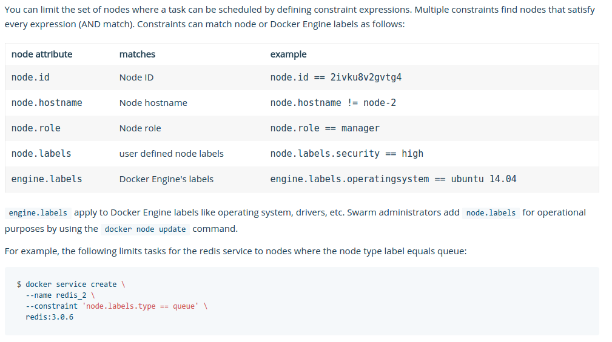

# A general Swarm demo to show basic connectivity and features of Docker swarm

* Start the Swarm Visualizer on the node that will be the manager

	https://github.com/ManoMarks/docker-swarm-visualizer

	* Run:
		* docker run -dt --name swarm-viz --rm -p 8080:8080 -v /var/run/docker.sock:/var/run/docker.sock  manomarks/visualizer
		* OR the sh script
			* ./runSwarmVisualizer.sh
		
	* This will start the manomarks swarm visualizer on port 8080 of the manager node

	

* On the server/VM/node that will be the manager:

	* docker swarm init

* You'll get a response similar to this:

   docker swarm join \
       --token SWMTKN-1-01xnj03daza6brr6cc9yp95jqbydlxfa2sk3j9wwpua33bgee8-8jyvgeqgjvst2hk03qxodb5f4 \
       192.168.254.32:2377

* Use the 'docker node ls' command to see what nodes are part of the 'swarm' after initializing
	* docker node ls

* You'll get a response similar to:

	

* On other nodes that you want to be part of the swarm, enter the 'docker swarm join' command that you got above from the 'docker swarm init' command:

	docker swarm join \
    --token SWMTKN-1-01xnj03daza6brr6cc9yp95jqbydlxfa2sk3j9wwpua33bgee8-8jyvgeqgjvst2hk03qxodb5f4 \
    192.168.254.32:2377

* NOTE: if you forget to copy the join command and/or you want to add additional nodes later, you can get the command again by entering this on the manager node:

	* docker swarm join-token worker

* For this demo, we'll add 4 other nodes.
	* Raspberry Pi Zero
	* Raspberry Pi Zero W
	* Raspberry Pi 2
	* Raspberry Pi 3

* After joining nodes to swarm, you can see their status with the 'docker node ls' command on the manager node:

* You'll get a response similar to:

	

* And on the Swarm Vizualizer:

	

* At this point, we have 5 nodes but nothing running

* On manager
   * docker service create --name hello --replicas=2 orax/alpine-armhf ping localhost
   * docker service ls
   * docker service scale hello=5
   * docker service ls
   * docker service scale hello=20
   * docker service ls
   * docker service rm hello
   * docker service ls

* Since the orax/alpine-armhf image is for the ARM processor, it won't run on x86 # so now let's start the same service but constrain it only to the worker nodes now create a service on the manager node and it will be deployed to the swarm
   * docker service create --name hello-arm --constraint node.role!=manager --replicas=20 orax/alpine-armhf ping localhost

* There's many constraint options, learn about them here:
   https://docs.docker.com/engine/reference/commandline/service_create/#specify-service-constraints---constraint

	

