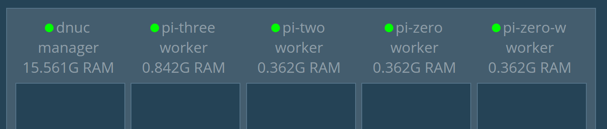

# A general Swarm demo to show basic connectivity and features of Docker swarm

* On the server/VM/node that will be the manager:

	* docker swarm init

* You'll get a response similar to this:

   docker swarm join \
       --token SWMTKN-1-01xnj03daza6brr6cc9yp95jqbydlxfa2sk3j9wwpua33bgee8-8jyvgeqgjvst2hk03qxodb5f4 \
       192.168.254.32:2377

* Use the 'docker node ls' command to see what nodes are part of the 'swarm' after initializing
	* docker node ls

* You'll get a response similar to:

	

* Start the Swarm Visualizer on the manager node

	https://github.com/ManoMarks/docker-swarm-visualizer

	* Run:
		* docker run -dt --rm -p 8080:8080 -v /var/run/docker.sock:/var/run/docker.sock  manomarks/visualizer
		* OR the sh script
			* ./runSwarmVisualizer.sh
		
	* This will start the manomarks swarm visualizer on port 8080 of the manager node

	

* On other nodes that you want to be part of the swarm, put the 'docker swarm join' command that you got above from the 'docker swarm init' command:

	docker swarm join \
    --token SWMTKN-1-01xnj03daza6brr6cc9yp95jqbydlxfa2sk3j9wwpua33bgee8-8jyvgeqgjvst2hk03qxodb5f4 \
    192.168.254.32:2377

* NOTE: if you forget to copy the join command and/or you want to add additional nodes later, you can get the command again by entering this on the manager node:

	* docker swarm join-token worker

* For this demo, we'll add 4 other nodes.
	* Raspberry Pi Zero
	* Raspberry Pi Zero W
	* Raspberry Pi 2
	* Raspberry Pi 3

* After joining nodes to swarm, you can see their status with the 'docker node ls' command on the manager node:

* You'll get a response similar to:

	

* And on the Swarm Vizualizer:

	

* At this point, we have 5 nodes but nothing running

on manager

docker service create --name hello1 --publish 3000:3000 --replicas=2 alexellis2/arm-alpinehello
curl -4 localhost:3000
docker service rm hello1

docker service scale hello=5

--constraint

You can limit the set of nodes where a task can be scheduled by defining constraint expressions. 
Multiple constraints find nodes that satisfy every expression (AND match). 
Constraints can match node or Docker Engine labels as follows:

node attribute	         matches	                  example
node.id	               Node ID	                  node.id == 2ivku8v2gvtg4
node.hostname	         Node hostname	            node.hostname != node-2
node role: manager	   Nose role                  node.role == manager
node.labels	            user defined node labels   node.labels.security == high
engine.labels	         Docker Engine's labels	   engine.labels.operatingsystem == ubuntu 14.04

docker node update --label-add ostype=pi pi1
docker service create --name selenfox --constraint 'node.labels.ostype == pi' blah/foo:latest
